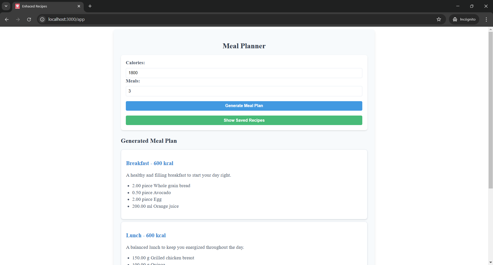

# Recipe AI Enhace

The app is able to create recipies for the calories requirements of each person. I have implements the registration and database for managing the recipes.

## ▶Installation and Running

`git clone https://github.com/Ernesto-Lora/recipe_AI_enhace.git`

Build and run the app:

`docker-compose run --build`
